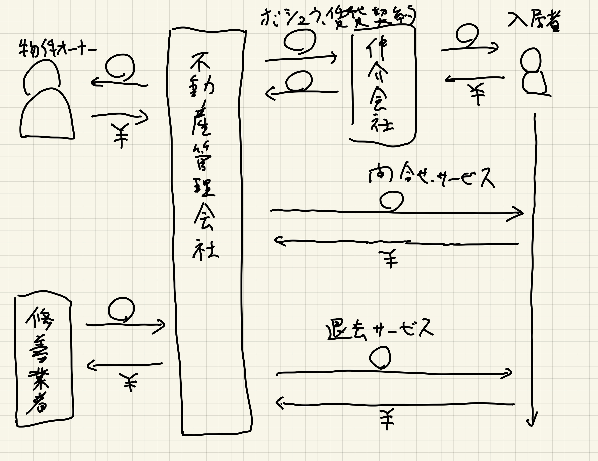
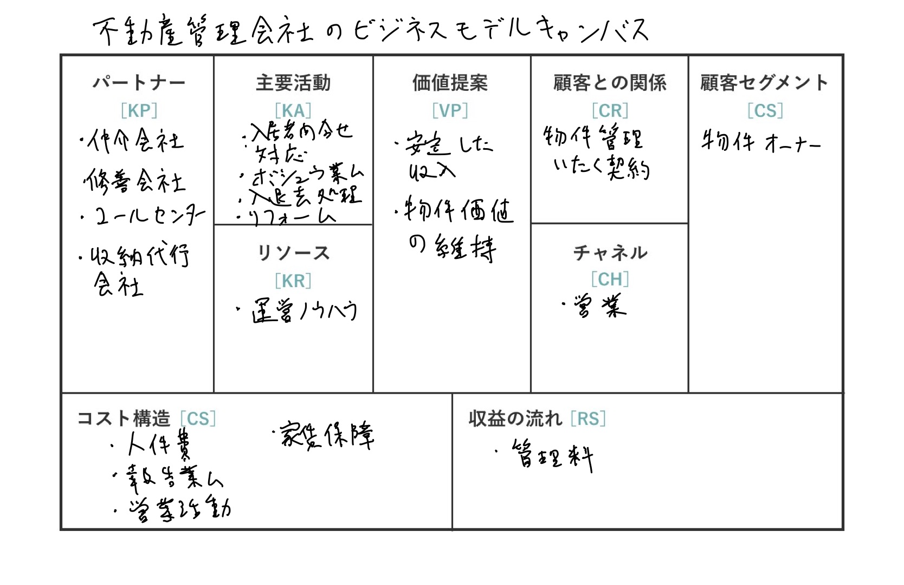

# tadasikutukurujuku_memo

## PICT図

## ビジネスモデルキャンバス

## DDD 第1章 知識をかみ砕くの「知識豊富な設計」のコード例の Before/After の違いは何か

* Afterのコードはビジネスルールをポリシークラスに分離し、閉じ込めた。

* 得られたこと: オーバーブッキングのルールがどういうルールか知りたいときは、オーバーブッキングポリシーを参照すれば知ることができるようになった。
* これはビジネスルールを他の処理から切り分けたこと、また、一つのビジネスルールが一つの場所に閉じ込められたことにより実現された。

